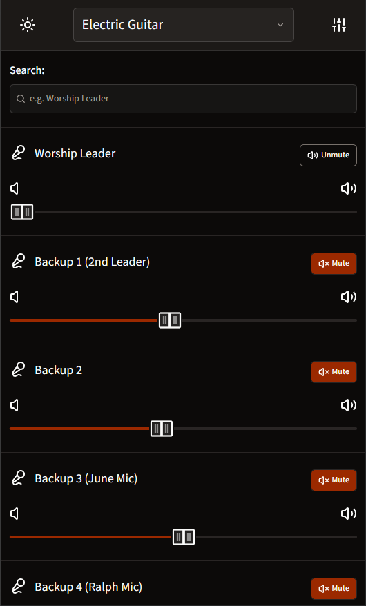
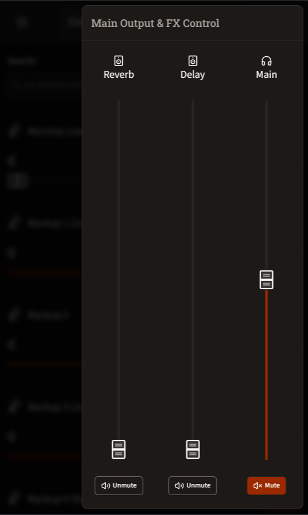

# L20 Mixer Control Web Interface

A modern web-based control interface for the Zoom L-20 mixer, built specifically for musicians to control their personal monitor mix volumes. This application provides real-time mixing capabilities with an intuitive UI for controlling faders, effects, and monitor sends directly from any device on the network.

## Features

- **Real-time Fader Control**: 18 channel faders with live volume adjustment
- **Master & Effects Control**: Dedicated controls for master, FX1, and FX2 tracks
- **Effects Sends**: Adjustable send levels to FX1 and FX2
- **Responsive Design**: Works seamlessly on desktop and tablet interfaces
- **WebSocket Integration**: Real-time synchronization with L20 hardware via Python backend
<!-- - **Channel Management**: Mute and solo functionality for individual channels -->
<!-- - **Pan Control**: Stereo pan adjustment per channel -->
<!-- - **EQ Control**: Phase, EQ on/off, low-cut filter, and 3-band EQ (low, mid, high) -->

## Tech Stack

- **Frontend**: [Next.js 16](https://nextjs.org) with React 19
- **Styling**: [Tailwind CSS](https://tailwindcss.com) with custom animations
- **UI Components**: [shadcn/ui](https://ui.shadcn.com) + [Radix UI](https://www.radix-ui.com)
- **Real-time Communication**: [next-ws](https://www.npmjs.com/package/next-ws) (WebSocket support)
- **Backend**: Python L20 controller (TCP socket communication)

## Prerequisites

- Node.js 18+ and npm/yarn/pnpm
- Python 3.7+ (for the L20 controller backend)
- L-20 audio mixer hardware

## Getting Started

### Frontend Setup

```bash
# Install dependencies
npm install

# Prepare Websocket for NextJS (next-ws)
npm run prepare

# Build NextJS
npm run build

# Run the server (runs on port 80)
npm run start
```

The app will be available at `http://localhost:80`

### Backend Setup

Set up the Python environment and run Backend Controller:

```bash
python -m venv .venv
pip install -r l20_controller/requirements.txt

python -m l20_controller.controller
```

The Python controller handles BLE communication with the L20 mixer hardware and bridges it via TCP Socket to the NextJS backend.

## Configuration

The application uses JSON configuration files stored in the `public/` directory:

- **`public/faders.json`**: Defines fader channels and their properties (names, IDs, etc.)
- **`public/tracks.json`**: Specifies track layouts and configurations for the mixer interface

These files are loaded at runtime to configure the mixer interface without requiring code changes.

## Project Structure

```
├── src/
│   ├── app/                 # Next.js app router
│   │   ├── api/ws/         # WebSocket endpoint
│   │   ├── layout.tsx      # Root layout
│   │   └── page.tsx        # Main page
│   ├── components/          # React components
│   │   ├── ui/             # shadcn/ui custom components
│   │   ├── MainFaderDrawer.tsx
│   │   ├── TrackFader.tsx
│   │   ├── TrackFaderList.tsx
│   │   └── ...
│   ├── contexts/            # React contexts
│   │   ├── L20SocketContext.tsx    # WebSocket state management
│   │   └── L20ChannelContext.tsx
│   ├── services/            # API/client services
│   │   ├── L20_client.ts    # L20 controller communication
│   │   └── fetchFaders.ts
│   ├── constants.ts         # App constants
│   └── types.ts             # TypeScript type definitions
├── l20_controller/          # Python backend
│   ├── controller.py        # Main L20 controller & BLE device management
│   ├── tcpsocket.py         # TCP socket server
│   ├── protocol.py          # Message protocol definitions
│   ├── decode.py            # L20 protocol decoding & MIDI parsing
│   ├── json_messages.py     # JSON message creation & parsing
│   ├── const.py             # MIDI constants and channel mappings
│   ├── __init__.py          # Package initialization
│   └── requirements.txt     # Python dependencies (bleak, mido)
└── public/                  # Static assets
    ├── faders.json
    └── tracks.json
```

### Communication Flow

```
L20 Mixer (Hardware)
    ↓ (BLE Communication)
l20_controller/controller.py
    ↓ (TCP Socket)
Next.js API route (src/app/api/ws/route.ts)
    ↓ (Websocket)
L20SocketContext
    ↓ (State)
React Components (Faders, Effects)
```

The application maintains a bidirectional WebSocket connection with the backend. User interactions (volume changes, mute) are sent as commands and hardware state updates are received and applied to the UI in real-time.

## Backend Features

The Python backend (`l20_controller`) includes:

- **BLE Device Discovery**: Automatic scanning and connection to L-20 mixer devices
- **MIDI Protocol Handling**: Full MIDI CC and SYSEX message processing for mixer control
- **TCP Socket Server**: Establishes TCP connection with the NextJS WebSocket endpoint
- **Real-time State Synchronization**: Tracks and transmits mixer channel information, volumes, and effects
- **JSON Message Protocol**: Structured communication between backend and frontend

## Scripts

```bash
npm run dev      # Start development server on port 80
npm run build    # Build for production
npm start        # Start production server on port 80
npm run lint     # Run ESLint
npm run prepare  # Prepare Websocket for NextJS
```

## Screenshots

<div align="center">
    
    
</div>


## Development Notes

- The app runs on **port 80** by default (can be changed in `package.json`)
- WebSocket patches are applied automatically via `next-ws patch` in the prepare script
- Component library uses Radix UI primitives with Tailwind CSS styling
- Theme support with [next-themes](https://github.com/pacocur/next-themes)

## Acknowledgements

This project uses the [PyL20](https://github.com/robig/PyL20) library by [Robert Gröber (robig)](https://github.com/robig) for L20 BLE protocol communication. I am grateful for the excellent work on reverse-engineering and documenting the L20 protocol.